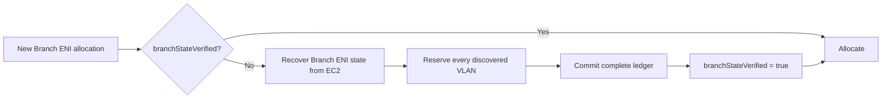

# VPC Resource Controller Restart Recovery and IP Reuse

> Status: Proposed
>
> Primary goal: Issue 634
>
> Related correctness issue: Issue 515 / private-IP reuse

## 1. Scope

This document separates two changes that must not be partially mixed.

| Flow | Owning change |
|---|---|
| Controller restart recovery without IP reuse | Issue 634 |
| IP reuse during restart | Issue 515 |
| IP reuse while the controller is already running | Issue 515 |

Issue 634 does not change CNINode ownership, delete/recreate CNINodes, or
replace a live NodeManager/provider cache. Issue 515 must handle restart and
non-restart IP reuse together so CNINode and in-memory generations transition
under one protocol.

Duplicate-VLAN quarantine and reactive orphan cleanup are not part of either
normal recovery flow.

## 2. Goals

### Issue 634

- Restore stable instance and trunk state without synchronous per-Node EC2
  discovery.
- Do not treat running Pod annotations as a complete Branch ENI/VLAN ledger.
- Before the first new Branch ENI allocation on a restored trunk, recover the
  complete Branch ENI/VLAN state from EC2.
- Never consume a checkpoint belonging to another EC2 instance.
- Reduce custom-networking subnet calls to one call per unique subnet per
  controller process.

## 3. Non-goals

- Changing CNINode owner references in Issue 634.
- Deleting or recreating a CNINode in Issue 634.
- Replacing a stale live NodeManager/provider cache in Issue 634.
- Solving only the restart half of IP reuse.
- Persisting the complete Branch ENI lifecycle in CNINode status.
- Changing duplicate-VLAN cleanup behavior.

## 4. Issue 634 restart recovery

### 4.1 Stable checkpoint

`CNINode.status.nodeNetworkState` stores stable recovery inputs:

- instance ID and type;
- primary subnet and CIDRs;
- primary ENI security groups;
- connection-tracking configuration;
- trunk ENI identity.

On controller restart, NodeManager has an empty in-memory cache:

```text
NodeController
    -> NodeManager.GetNode = cache miss
    -> AddNode
    -> submit Init job
```

The Init job validates:

```text
checkpoint instance ID
    ==
current Kubernetes Node providerID instance ID
```

If they match, Init restores the stable instance and trunk state. If they do not
match, the checkpoint is not consumed.

### 4.2 Branch-state verification

Running Pod annotations identify Branch ENIs owned by live Pods, but they do not
include ENIs in cooldown, deletion, failed-allocation or orphan states.

After checkpoint-based trunk recovery, the trunk starts with:

```go
branchStateVerified = false
```

Every path that can choose a VLAN or create a Branch ENI must first ensure the
flag is true.



Recovery requirements:

1. Query all controller-managed Branch ENIs for the trunk.
2. Handle pagination.
3. Do not restrict the query to the current subnet.
4. Use Pod annotations to identify Pod-owned ENIs.
5. Reserve the VLAN of every Branch ENI returned by EC2.
6. Commit the complete ledger atomically.
7. Set `branchStateVerified` only after the complete commit succeeds.
8. On any failure, leave the flag false and return a retryable allocation
   error.

Only one recovery operation may run concurrently for a trunk. The first Pod
performs the EC2 query; other Pods wait for the same result.

No additional recovery-specific backoff is introduced. Existing Pod allocation
retry behavior controls subsequent attempts after a failed EC2 query.

### 4.3 Custom networking

The restored checkpoint does not override current ENIConfig.

Current custom-networking subnet CIDRs are resolved through a process-wide
cache. Concurrent misses for the same subnet share one EC2 request.

The expected call count is:

```text
O(unique custom-networking subnets per controller process)
```

instead of:

```text
O(custom-networking Nodes)
```

## 5. Issue 515: IP reuse as one generation transition

Issue 515 owns CNINode freshness and live cache replacement. Its design must
cover both controller states.

### 5.1 Persistent object freshness

When a current Node has the same name as an old Node, the old CNINode cannot be
used as the current Node's dependency.

The Issue 515 protocol is:

1. identify the CNINode generation by owner Node UID;
2. read Node/CNINode identity through the uncached API reader;
3. persist the current Node UID and old desired CNINode spec in a dedicated
   checkpoint CNINode before deleting the old object; mirror it in a Node
   annotation for the common path. The checkpoint also records the source
   CNINode UID as the replacement transaction identity;
4. delete an active stale CNINode with UID and resource-version preconditions;
5. wait while the old object is deleting;
6. recreate a successor owned by the current Node UID from the persisted
   checkpoint;
7. preserve authoritative desired features;
8. never copy old instance-specific runtime status into the successor;
9. clear the annotation after the current-owner successor exists;
10. allow `AddNode` only after the current-owner successor exists.

The successor is the replacement CNINode for the current Kubernetes Node
generation. Readiness is based on its owner Node UID, not on status instance ID:
the successor intentionally starts with empty runtime status, which normal Node
initialization fills.

The checkpoint CNINode is not owned by a Node generation, so it survives both a
controller restart and another real delete/create rollover of the same-name
Node. If the old canonical CNINode and its Node annotation disappear,
NodeController can still recreate the successor without losing
`spec.features`. The Node annotation is only a local mirror for the common
path; it is written only during CNINode generation replacement.

Checkpoint clearing is conditional on the source CNINode UID and deletes the
durable record with UID/resource-version preconditions. Completion of an older
replacement cannot clear a newer replacement checkpoint. The Node annotation
is retained until durable-record cleanup succeeds, so cleanup failures remain
retryable. If the Kubernetes Node UID changes again while replacement is in
progress, NodeController moves the same checkpoint to the latest generation
before creating the successor.

A terminating Node is never treated as the successor generation. Its CNINode
follows normal finalization; replacement is attempted only for a non-terminating
current Node.

If the old Node and CNINode have already fully finalized before any same-name
Node exists, there is no stale generation transition left for Issue 515. The
later Node follows the existing new-Node CNINode creation path; reconstruction
of desired feature fields in that path remains the responsibility of their
field owner.

### 5.2 Restart path

After controller restart, NodeManager and provider caches are empty. Once the
current-owner CNINode exists, the normal `AddNode` path can initialize the
current instance and write fresh status. If the persisted CNINode belongs to an
old Node UID, the same delete/successor gate runs before `AddNode`.

### 5.3 Non-restart path

Without controller restart, stale in-memory state may still exist:

```text
Kubernetes Node = current instance
CNINode          = old or deleting generation
NodeManager      = old instance still cached
Provider cache   = old trunk may still be present
```

The generation-aware handoff is:

```text
cached instance mismatch
    -> DeleteNode(old generation)
    -> fence old manager jobs with a lifecycle token
    -> keep AddNode blocked while provider de-initialization has not succeeded
    -> AddNode(current generation)
    -> retry current Init while the old trunk is retained for Pod eviction
    -> adopt a same-instance trunk with a new provider-cache token
    -> old delayed cleanup removes only its matching instance and cache token
    -> current Init installs the current trunk and marks the Node ready
```

The manager delete job retries every 30 seconds if provider de-initialization
fails. These timed retries are not subject to the worker's finite error retry
limit. The current Init job similarly retries while the previous trunk
generation remains in cache, so convergence does not depend on another
Kubernetes Node event.

NodeController compares both Kubernetes Node UID and EC2 instance ID. It does
not call `UpdateNode` for a cached generation with a different UID, including
when the same EC2 instance ID is reused, or while current-generation
initialization is pending.

PodController reads the current Kubernetes Node through the uncached API reader
and compares its instance ID with the cached manager Node before any create
allocation. It passes the validated Pod UID and Node name/UID/instance ID
through the handler and queued job. Provider acquisition must match that exact
identity, so a request validated for generation B cannot allocate from
generation C even when the EC2 instance ID is reused.

The handoff waits for local ownership of the cache, not for every old EC2
resource to finish deleting.

Every manager Init/Update/Delete job carries a lifecycle token. An Init queued
for an old token is skipped. If an old Init was already running and finishes
after the generation changed, it schedules provider cleanup instead of marking
the current Node ready.

The manager counts running Init and cleanup operations for each lifecycle.
`AddNode` remains blocked until all old Init operations have exited and at least
one cleanup after the final old Init has succeeded. A late retry for a completed
generation is skipped before it can call a provider.

Every delayed branch cleanup job carries both the old instance ID and the
provider-cache token. It removes the cached trunk only when both still match.
This also protects a managed-to-unmanaged-to-managed transition on the same EC2
instance, where instance ID alone cannot distinguish the two lifecycles.
Same-instance token renewal and cache lookup happen under the provider cache
lock, so adoption cannot race removal by an old delayed job.

Windows secondary-IP and prefix warm-pool jobs carry the provider-cache token
that created them. A stale queued job is dropped before EC2 or pool mutation.
Provider cache removal or replacement waits for a job that already acquired the
old generation, so an in-flight old job cannot cross into the replacement pool.
Synchronous Pod allocation and release hold the same generation lease through
pool mutation and Pod annotation.

Branch allocation holds a per-trunk lifecycle lease through recovery, EC2
association and Pod annotation. Same-instance adoption and delayed trunk removal
take the exclusive side of that lease, so they wait for a running allocation
without serializing unrelated Nodes.

Provider de-initialization failures increment
`node_generation_cleanup_retry_total`; the current number of manager
generation barriers is exposed as `node_generation_cleanup_pending`. A current
Init waiting for an old provider generation also increments the retry counter,
so a trunk that never leaves provider cache remains observable after the
manager barrier has completed.

## 6. Change ownership

### Issue 634 owns

- Stable `NodeNetworkState` checkpoint.
- Instance-ID validation at the checkpoint consumption boundary.
- Stable trunk restoration.
- Pod annotations as the source of live Pod ownership.
- Custom-subnet process cache and concurrent lookup coalescing.
- Normal `AddNode` CNINode creation.
- Add `branchStateVerified` to the restored trunk.
- Do not treat Pod annotations as proof of a complete VLAN ledger.
- Recover the complete Branch ENI state from EC2 before the first allocation.
- Block all VLAN selection while the flag is false.
- Remove the current-subnet filter from Branch ENI recovery.

### Issue 515 owns

- NodeController stale-CNINode deletion.
- Durable, generation-independent CNINode replacement checkpoint, with a Node
  annotation mirror.
- CNINodeController current-owner replacement.
- Manager lifecycle fencing and cleanup barrier.
- Instance-and-cache-generation-aware delayed cleanup jobs.
- Generation-aware Windows secondary-IP and prefix warm-pool jobs.
- Synchronous warm-pool and Branch allocation generation leases.

### Neither change owns

- New duplicate-VLAN quarantine/orphan-cleanup behavior added specifically to
  compensate for incomplete restart state.
- New recovery-specific retry/backoff.

## 7. Correctness invariants

### Restart recovery

1. A checkpoint for another instance is never consumed.
2. No VLAN is selected while `branchStateVerified` is false.
3. Every EC2 Branch ENI reserves its VLAN before verification succeeds.
4. Partial recovery never sets the flag.
5. Only one recovery operation runs concurrently per trunk.

### Issue 515

1. Stale CNINode deletion uses a UID precondition.
2. The same deletion is fenced by the CNINode resource version whose spec was
   checkpointed.
3. Desired spec survives a restart in the CNINode delete/create gap.
4. Desired spec also survives another real Node UID rollover in that gap.
5. The successor belongs to a non-terminating current Node controller owner.
6. Old runtime status is not copied.
7. A cached instance-ID mismatch never enters `UpdateNode`.
8. A stale Init cannot install or mark ready an old generation.
9. A late old Delete cannot call a provider after its generation barrier closes.
10. `AddNode` remains blocked until running old Init and provider
   de-initialization have converged.
11. Current initialization remains retryable while the old trunk handles Pod
   eviction.
12. Old asynchronous cleanup cannot mutate the current generation, including
    when the EC2 instance ID is reused by another local lifecycle.
13. Pod creation cannot allocate from a manager/provider cache whose Node UID or
    instance ID differs from the generation validated by PodController.
14. Provider generation replacement or removal waits for synchronous allocation
    and its Pod annotation to finish.

## 8. Validation

| Test | Expected result |
|---|---|
| Restart with existing idle Nodes | Stable state restores without per-Node Branch ENI discovery |
| First allocation on a restored trunk | One EC2 recovery, then `branchStateVerified=true` |
| Concurrent allocations on one trunk | One recovery; remaining requests wait |
| EC2 or pagination failure | Flag stays false; no VLAN is allocated |
| Transitional Branch ENI | Its VLAN is reserved before allocation |
| Branch ENI in an old custom subnet | Found because recovery has no subnet filter |
| Restart with stale CNINode owner | UID-precondition delete; wait for current-owner successor |
| Cached Node lags checkpoint write | Uncached read finds checkpoint; `AddNode` does not create a minimal CNINode |
| Restart in CNINode delete/create gap | Successor recreated from Node annotation; desired features retained |
| Another Node UID rollover in that gap | Successor recreated from durable checkpoint CNINode |
| CNINode spec changes before delete | Resource-version conflict; checkpoint refreshes before retry |
| Successor creation | Desired features retained; old runtime status empty |
| Same-name Node is terminating | No successor is created for the terminating UID |
| Live manager instance mismatch | Delete old generation; never call `UpdateNode` |
| Same instance ID, different Node UID | Delete old manager generation; reinitialize current generation |
| Pod create before NodeController handles mismatch | Requeue before any allocation |
| Provider de-init failure | 30-second timed retry; `AddNode` remains blocked |
| Old Init finishes after generation change | Old resources are de-initialized; current cache is unchanged |
| Old Delete retries after barrier completion | Retry is skipped before provider calls |
| Old trunk retained for Pod eviction | Current Init retries until old trunk leaves |
| Late old branch cleanup | No-op against a newer instance or provider-cache generation |
| Same-instance adoption races delayed cleanup | Per-trunk lifecycle lease serializes token renewal and removal |
| Delayed trunk cleanup races Branch allocation | Cleanup waits through EC2 association and Pod annotation |
| Old Windows IP/prefix warm-pool job | No EC2 or replacement-pool mutation |
| Provider replacement during a running warm-pool job | Replacement waits for the old job to exit |
| Provider replacement during synchronous warm-pool allocation | Replacement waits through Pod annotation |

## 9. Decisions requested

1. Accept Branch-state recovery before the first new allocation instead of
   during every Node restart.
2. Accept one Branch ENI EC2 query per restored trunk that receives a new
   allocation.
3. Keep all CNINode and in-memory generation replacement out of Issue 634.
4. Require Issue 515 to solve restart and non-restart IP reuse together.
